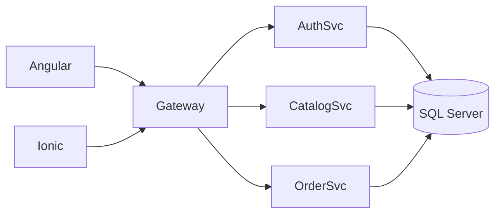

# Documentación del Proyecto — V3
**Fecha:** 2025-10-15

Este paquete contiene la documentación en Markdown por módulo (microservicios, gateway, frontends y base de datos).  
Redacción en español técnico, concisa y alineada a la arquitectura de microservicios.

## Contenido
- `/AuthSvc/README.md`
- `/CatalogSvc/README.md`
- `/OrderSvc/README.md`
- `/Gateway/README.md`
- `/appAngular/README.md`
- `/appIonic/README.md`
- `/MSSQL/README.md`

## Arquitectura (Mermaid)

