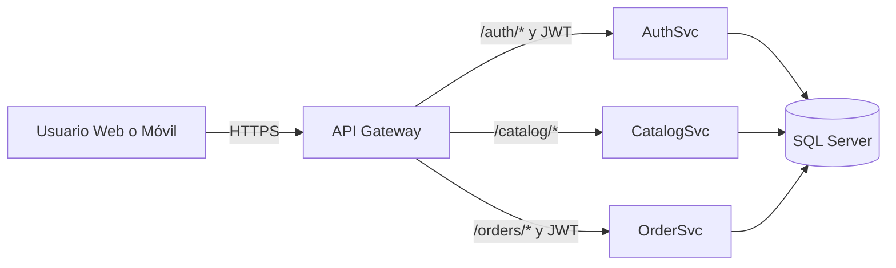
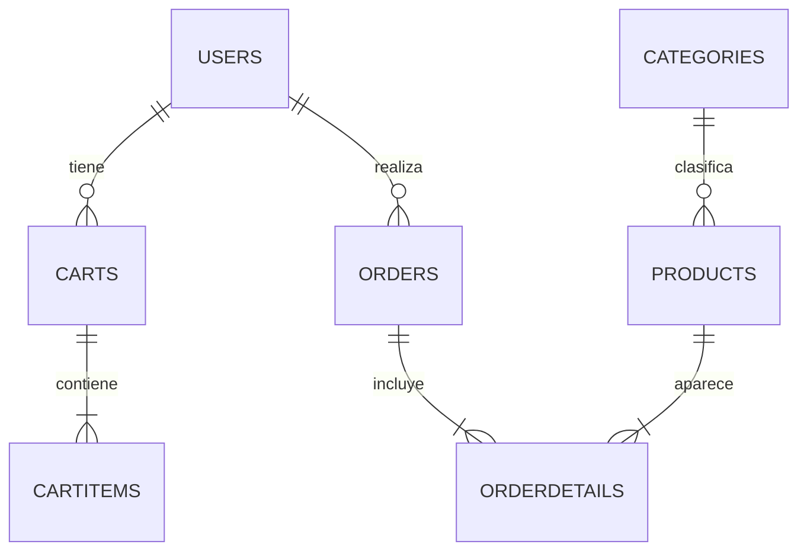
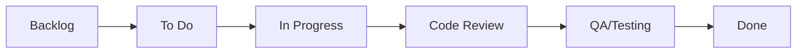

# Documentación del Proyecto E-Commerce

---

## 🧩 1. Arquitectura General del Sistema

### Descripción
El sistema adopta **microservicios** con un **API Gateway** como punto único de entrada. Cada servicio es independiente (autenticación, catálogo, órdenes), expone **REST** y persiste en **SQL Server**. Se privilegia **bajo acoplamiento**, **alta cohesión**, **DDD**, **SOLID**, y despliegue independiente.

### Componentes
| Componente | Tecnología | Rol |
|----------------------------|---------------------|---------------------------------------------------------------------|
| **AuthSvc** | .NET 8 Minimal APIs | Registro, login, emisión de **JWT** y **refresh tokens**, perfil. |
| **CatalogSvc** | .NET 8 Minimal APIs | Productos, categorías, precios, inventario, filtros y paginación. |
| **OrderSvc** | .NET 8 Minimal APIs | Carrito persistente, checkout transaccional, órdenes. |
| **API Gateway/Reverse Proxy** | YARP/NGINX | Ruteo, validación de JWT, CORS, rate‑limit (opcional). |
| **Base de datos** | SQL Server 2022 | Modelo relacional, SPs transaccionales. |
| **Frontend Web** | Angular 16 + Material | UI web para clientes y admins. |
| **Frontend Móvil/PWA** | Ionic 7 (Angular) | App móvil/PWA con almacenamiento seguro. |

---

## 🧱 2. Diagrama General


**Notas**
- El Gateway valida JWT y enruta.
- Los servicios comparten instancia SQL en este MVP (separación futura por servicio es posible).
- Los SPs encapsulan lógica de negocio crítica (stock, checkout).

---

## 🔐 3. AuthSvc (Autenticación y Seguridad)

### Funcionalidades
- Registro, login, perfil.
- Emisión de **JWT (HS256)** de corta duración y **refresh tokens**.
- Hash de contraseñas (**bcrypt** o **PBKDF2**), validación y bloqueo básico.
- **Roles/claims** para autorización por endpoint.

### Endpoints (resumen)
| Método | Ruta | Descripción |
|--------|------------------|-------------------------------------------|
| POST | /auth/register | Alta de usuario. |
| POST | /auth/login | Devuelve access_token + refresh_token. |
| POST | /auth/refresh | Renueva access_token desde el refresh. |
| GET | /auth/profile | Datos del usuario autenticado. |

### Flujo de Login
```mermaid
sequenceDiagram
  participant U as User
  participant G as Gateway
  participant O as OrderSvc
  participant DB as SQL Server

  U->>G: POST /orders/checkout (JWT)
  G->>O: Proxy + claims
  O->>DB: BEGIN TRAN; valida stock carrito
  DB-->>O: OK
  O->>DB: INSERT order + details; descuenta stock
  DB-->>O: COMMIT
  O-->>G: 200 (orderId)
  G-->>U: 200 (orden creada)
```

---

## 🗂️ 4. CatalogSvc (Catálogo de Productos)

### Funcionalidades
- CRUD de productos/categorías.
- Filtros, orden, paginación.
- Control de inventario y precios.
- Endpoints públicos para explorar y privados para administrar.

### Endpoints (resumen)
| Método | Ruta | Descripción |
|--------|-------------------------------|----------------------------------------------------------|
| GET | /catalog/products | Lista (filtros q, category, page, size). |
| GET | /catalog/products/{id} | Detalle. |
| POST | /catalog/products | Crear (admin). |
| PUT | /catalog/products/{id} | Actualizar. |
| DELETE | /catalog/products/{id} | Eliminar. |
| GET | /catalog/categories | Lista categorías. |

---

## 🛒 5. OrderSvc (Carrito y Órdenes)

### Funcionalidades
- Carrito persistente por usuario: agregar, actualizar, eliminar ítems.
- Checkout transaccional con SPs (valida stock, descuenta inventario, crea orden).
- Recuperación de órdenes por usuario.

### Endpoints (resumen)
| Método | Ruta | Descripción |
|--------|----------------------------------|----------------------------------------------|
| GET | /orders/cart | Obtener carrito del usuario. |
| POST | /orders/cart/items | Agregar o fusionar ítem (productId, qty). |
| PUT | /orders/cart/items/{productId} | Actualizar cantidad. |
| DELETE | /orders/cart/items/{productId} | Quitar ítem. |
| POST | /orders/checkout | Ejecuta checkout (SP). |
| GET | /orders/{orderId} | Detalle de orden. |

### Flujo de Checkout
```mermaid
sequenceDiagram
    participant U as Usuario
    participant G as Gateway
    participant O as OrderSvc
    participant DB as SQL Server

    U->>G: POST /orders/checkout (JWT)
    G->>O: Proxy + claims
    O->>DB: BEGIN TRAN; valida stock carrito
    DB-->>O: OK
    O->>DB: INSERT order + details; descuenta stock
    DB-->>O: COMMIT
    O-->>G: 200 (orderId)
    G-->>U: 200 (orden creada)
```

---

## 🗄️ 6. Base de Datos SQL Server

### ER (alto nivel)


### Principios
- **3FN**, FKs y restricciones de integridad.
- SPs con TRY/CATCH y transacciones (BEGIN/COMMIT/ROLLBACK).
- Índices en claves de búsqueda (SKU, category, UserId, OrderId).
- Auditoría básica (CreatedAt, UpdatedAt).

---

## ⚙️ 7. Seguridad Aplicada (E2E)
- **JWT (HS256)** con expiración corta; refresh tokens en tabla dedicada.
- Validación de **roles/claims** en Gateway y/o endpoints.
- **CORS** restringido a dominios frontend; **HTTPS/TLS** obligatorio.
- **Rate limiting** en Gateway (opcional).
- Protección de secretos por **variables de entorno** y **vault**.
- **Logs** de acceso/autorización y auditoría de cambios críticos.

---

## 🔁 8. API Gateway / Reverse Proxy
- Termina TLS, valida **Bearer JWT** y enruta por prefijo (/auth, /catalog, /orders).
- Aplica CORS, compresión, timeouts y, opcionalmente, **circuit‑breaker**.

**Estructura de rutas sugerida:**
```bash
/auth/*    -> AuthSvc
/catalog/* -> CatalogSvc
/orders/*  -> OrderSvc
```

---

## 🚀 9. CI/CD y Despliegue
- Git (feature branches + PRs).
- GitHub Actions: build, test, publish artefacts; despliegue a **staging** y **prod**.
- Versionado semántico, changelogs y release pipelines.
- Preparado para **Docker** (por servicio) y orquestación futura con **Kubernetes**.

---

## 🧠 10. Metodología Scrum + Jira

### Roles y valores
- **PO** (valor de negocio), **Scrum Master** (facilitador), **Developers** (entrega).
- Valores: **compromiso, foco, apertura, respeto, coraje**.

### Ceremonias y artefactos
- **Sprint Planning**: Objetivo + Sprint Backlog.
- **Daily**: 15 min, impediments visibles.
- **Review**: demo del incremento potencialmente desplegable.
- **Retrospective**: acciones de mejora.

### Workflow Jira


---

## 📊 11. Métricas y Resultados Técnicos
| Indicador | Objetivo/Resultado | Notas |
|-------------------|--------------------|------------------------------------|
| Latencia p50 | < 200 ms | Endpoints críticos cacheables. |
| Uptime | ≥ 99.9% | Health‑checks, reinicios controlados.|
| Cobertura pruebas | ~85% | Unitarias + E2E en flujos clave. |
| Tiempo de deploy | < 5 min | CI/CD automatizado. |
| Escalabilidad | Horizontal | Réplicas por servicio en K8s. |
| Seguridad | Alta | JWT + HTTPS + roles/claims. |

---

## ❓ 12. Preguntas y Respuestas (Entrevista)
**¿Por qué microservicios y no monolito?**  
Separación de dominios, despliegue independiente, escalado selectivo, equipos autónomos.

**¿Por qué .NET 8 Minimal APIs?**  
Menor _boilerplate_, rendimiento alto, fácil versionado de endpoints, ideal para microservicios.

**¿Cómo garantizas atomicidad en checkout?**  
SP con BEGIN TRAN + validación de stock + inserciones de encabezado/detalle + COMMIT/ROLLBACK.

**¿Y si dos usuarios compran el último ítem?**  
Bloqueos a nivel de fila o check‑and‑set; en conflicto, rollback e idempotencia en el flujo de solicitud.

**¿Cómo renuevas tokens de forma segura?**  
Refresh token único y rotativo por sesión, guardado en DB; revocación y expiración.

**¿Cómo pruebas la solución?**  
Unitarias (servicios), integración (API↔DB), E2E (flujos UI), carga (k6), monitoreo (logs/métricas).

**¿Cómo sería la evolución a escala?**  
Docker + K8s, HPA, service mesh, colas (RabbitMQ/Kafka) para asincronía.

---

## 🧭 13. Recomendaciones para la Entrevista
- Explica el **por qué** de cada tecnología (no solo el **qué**).
- Demuestra seguridad (JWT + refresh + claims) y transacciones SQL.
- Si piden diagrama, dibuja **Frontend → Gateway → Microservicios → SQL**.
- Habla con métricas (latencia, cobertura, tiempo de deploy).
- Scrum con sprints quincenales y backlog en Jira.
- Propón **Docker + Kubernetes** para escalar.
- Muestra liderazgo: code review, estándares, comunicación con PO/stakeholders.
